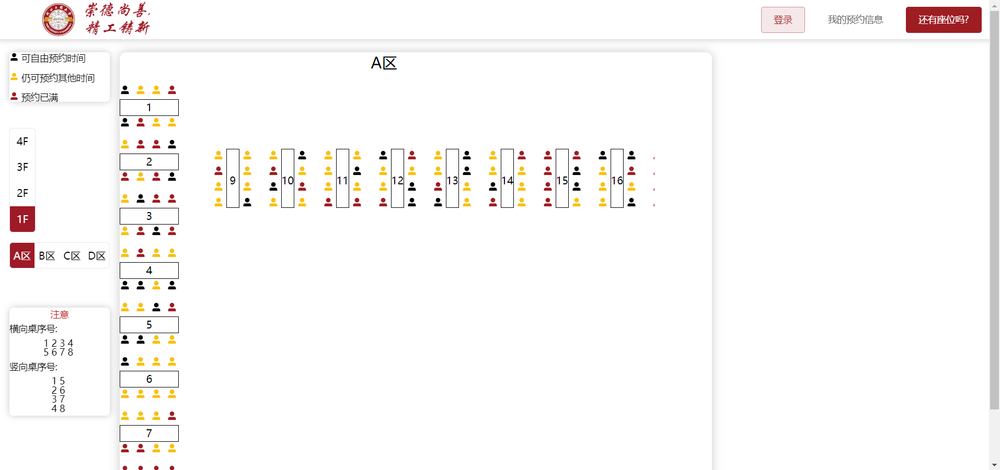
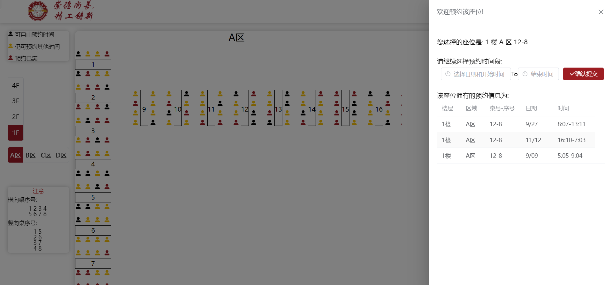
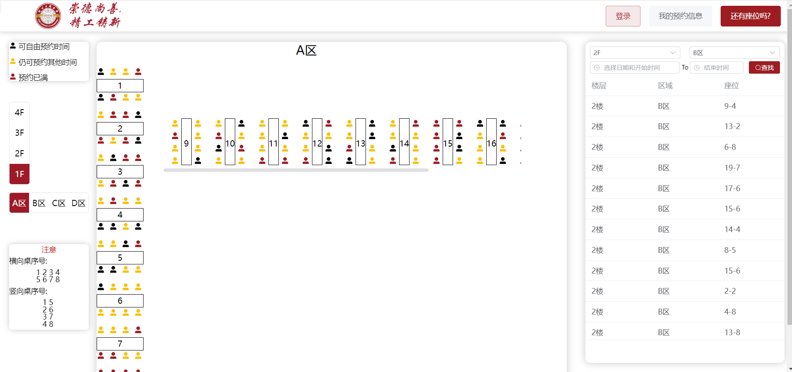
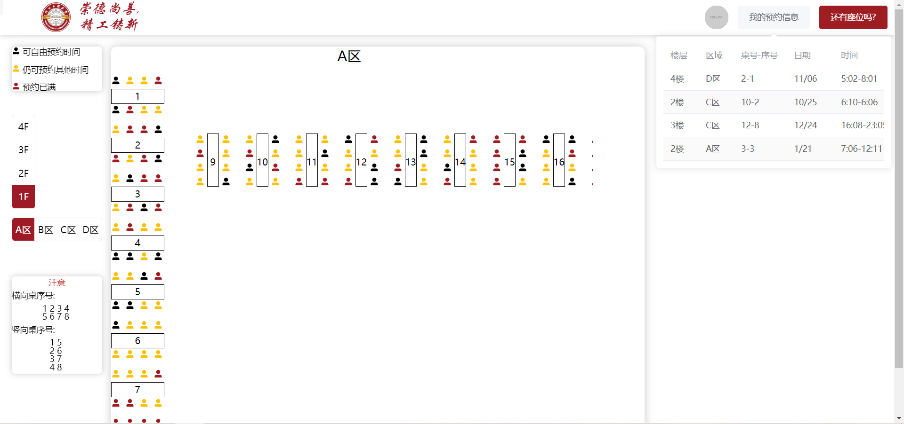
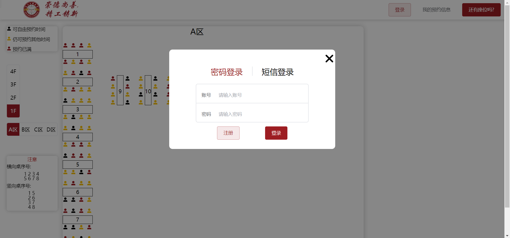
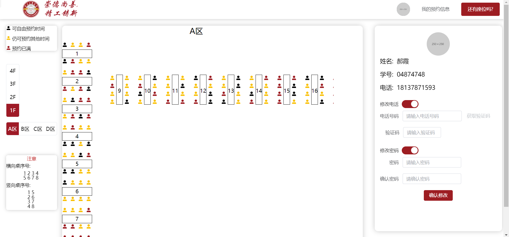

# 前言

本项目是由[Vite](https://cn.vitejs.dev/)+[VUE3](https://cn.vuejs.org/)+[TypeScript](https://typescript.bootcss.com/)所搭建的纯前端工程,目的是实现图书馆座位的可视化选座预约,解决了常规图书馆预约系统无法看到具体位置的痛点.此外,项目还是用了[TailWindcss](https://www.tailwindcss.cn/)+[ElementUI](https://element-plus.org/zh-CN/)来简化CSS设计以及UI设计以及其它例如，vuerouter、pinia和axios等相关封装,并使用基于mock.js的Apifox模拟后端请求.最后,该项目主要是为了学习与练习使用相关技术,若有方法使用不当的情况,请及时反馈.

# 使用方法

## 运行

使用`npm install i`或你喜欢的包管理器来安装依赖

使用`npm run dev`运行项目

## 所需接口支持

项目已使用apifox在线模拟后端接口可保证项目正常运行,若需要实现具体接口功能完善项目业务逻辑,项目接口要求见[项目接口文档](./可视化座位预约项目接口.md)

# 基础功能介绍

## 预约信息以及预约

进入项目主页,等待加载完成后便可看到座位相对位置以及预约情况.

人像代表座位,点击人像即可进入预约界面.在预约界面可看到座位已有预约信息和进行预约操作

## 查询可用座位以及我的预约

在主界面,点击"还有座位吗"功能按钮,可根据自身要求对相关可用座位进行查询.

在主界面,处于已登陆的情况下点击"我的预约信息"功能按钮,可查询自己的预约信息.

## 登录以及我的信息

在未登录时点击头像可进行注册登录,在登陆后点击头像可修改自己的相关信息

# 后续期望

- 签到功能

- 增加头像的查看与修改

- 丰富主页座位选择模块的内容

- 美化部分UI

- ...

  
